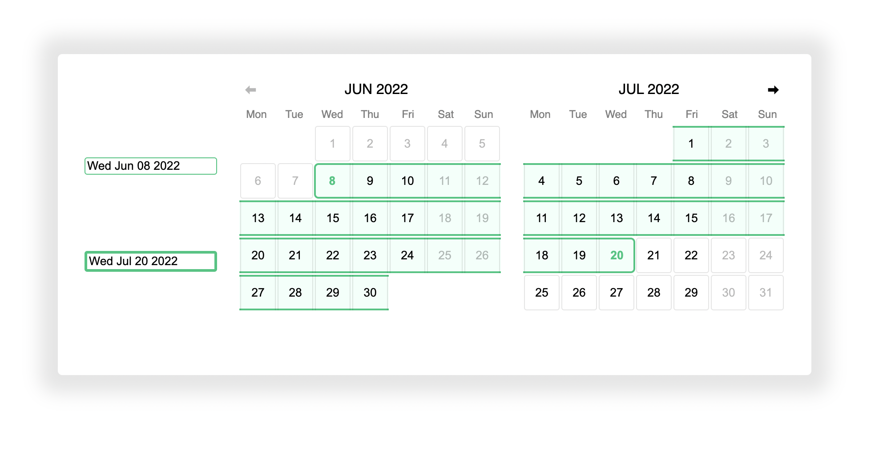

# `yet-another-calendar`

A simple yet highly customizable calendar library for React.

Prides itself on having both a **very simple API**, but also **extreme flexibility**.

## Installation

`npm i yet-another-calendar` or `yarn add yet-another-calendar`

## Usage

```tsx
import { useState } from "react";
import { Calendar, Page, nextPage } from "yet-another-calendar";

const Date = ({ date }) => <button>{date.getDate()}</button>;

const App = () => {
  const [page, setPage] = useState<Page>({ month: "may", year: 2022 });

  return (
    <div>
      {page.month} {page.year}
      <button onClick={() => setPage(nextPage)}>⮕</button>
      <Calendar page={page} renderDate={Date} />
    </div>
  );
};
```

## Why this Calendar Library?

- **Complete behaviour flexibility**, support for:
  - **date pickers**
  - Multiple **range** selectors
  - Disabled dates
  - & more!
- **Simple** API
  - Just 2 props!
- All _styles_ can be controlled like any other React component
  - For example, using `styled-components`
- Fully **controlled**!
- Fully **typed**!
- Fully **tested** - 100% code coverage!
- Loads of **examples**!
- **32x smaller** bundle size compared to the most popular competitors!
- Fully **Internationalizable** & right-to-left option
- Great support for **accessibility**

Looks like this - but **don't worry**, a little styling and it can look however you want!


## More Complex Example - "Date Range Picker"



[See this example on CodePen](https://codepen.io/angusjf/pen/bGLKeEj)

## When is this not the right library?

If you don't care what your calendar looks like, or how it behaves, and just want
a calendar in your website ASAP - this library might not be for you.

## API

### `<Calendar>`

This is the only exported React Component. All the props are optional, but you'll probably want to set `page` and `renderDate`.

### `CalendarProps`

| Prop               | Type                                      | Example                                     |
| ------------------ | ----------------------------------------- | ------------------------------------------- |
| `page`             | `Page`                                    | `{ year: 2022, month: 'jan' }`              |
| `renderDate`       | `(props: DateRenderProps) => JSX.Element` | `({date}) => <span>{date.getDate()}</span>` |
| `calendarStartDay` | `CalendarStartDay`                        | `"sunday"`                                  |

All the props from `div` are also supported:

```tsx
<Calendar dir="rtl" style={{ backgroundColor: "red" }} />
```

### `DateRenderProps`

For `Calendar`'s `renderDate` prop (above).

| Prop            | Type                                |
| --------------- | ----------------------------------- |
| `date`          | `Date`                              |
| `belongsToPage` | `"previous" \| "current" \| "next"` |

### `Page`

| Field   | Type                             |
| ------- | -------------------------------- |
| `year`  | `number`                         |
| `month` | `"jan" \| "feb" \| ... \| "dec"` |

### CalendarStartDay

Used to control if the calendar starts on a Monday or Sunday.

### Utility Functions

| Function       | Type                   |
| -------------- | ---------------------- |
| `nextPage`     | `(page: Page) => Page` |
| `previousPage` | `(page: Page) => Page` |
| `firstDate`    | `(page: Page) => Date` |
| `lastDate`     | `(page: Page) => Date` |
| `pageForDate`  | `(date: Date) => Page` |

## Motivation

Calendars shouldn't have a mind of their own.

Developers should be able to **_control_** their calendars with `props`!

This way the behaviour of the calendar is **_predictable_** and **_customisable_**.

This library was built with the idea that the developer should have **_complete control_** over their components state. It is proof that 'dumb' components only allow for **_greater flexibility_**, but also make interfaces **_simpler_**!
